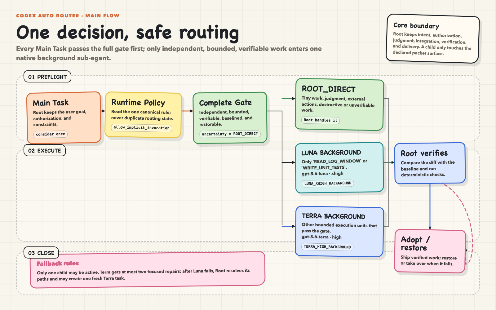
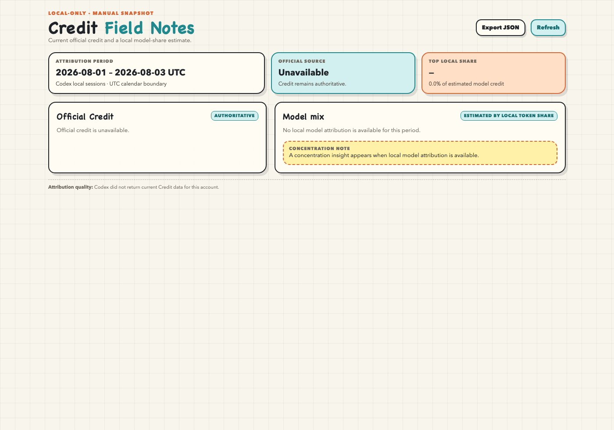

<h1 align="center">Codex Auto Router</h1>

<p align="center">
  <strong>Route Codex Main Tasks across quality, cost, and safety boundaries.</strong>
</p>

<p align="center">
  Root keeps high-judgment quality; Terra / Luna handle lighter, cost-efficient bounded work in the background.
</p>

<p align="center">
  <a href="https://github.com/miniLV/codex-auto-router">GitHub</a> ·
  <a href="README.md">简体中文</a> · <strong>English</strong>
</p>

<p align="center">
  <a href="#3-minute-start"><strong>3-minute start</strong></a> ·
  <a href="#core-flow"><strong>Core flow</strong></a> ·
  <a href="#self-checking-cost-locally"><strong>Cost self-check</strong></a>
</p>

<p align="center">
  
</p>

<sub>Rendered with <a href="https://github.com/miniLV/sketchboard-diagram">sketchboard-diagram</a>; the editable source is <a href="docs/diagrams/auto-routing-en.html">docs/diagrams/auto-routing-en.html</a>.</sub>

## What it solves

An AI coding assistant should not send every task to the most expensive model, and it should not trade away Root's judgment or final verification just to save cost. This project separates those responsibilities:

- **Sol / Root protects quality**: it keeps user intent, authorization, complex judgment, external actions, integration, final verification, and delivery.
- **Terra / Luna reduce execution cost**: only independent, bounded, restorable, deterministically verifiable units go to the background; they are usually lighter and faster for repeatable engineering work.
- **Safety beats price**: cost is never the only routing signal. Unclear ownership, baselines, recovery, or acceptance returns the task to `ROOT_DIRECT`.
- **Local and auditable**: the policy, Task Packet, lifecycle, and Dashboard live in this repository; there is no black-box scheduler.

## 3-minute start

Prerequisites: Node.js 22+ and a Codex CLI installation that has been signed in. The project never installs or upgrades Codex CLI for you:

```sh
# macOS / Linux
curl -fsSL https://chatgpt.com/codex/install.sh | sh

# macOS / Homebrew
brew install codex

# Windows, or any platform with npm
npm install --global @openai/codex

codex
codex --version
npm run setup
npm start
```

`npm run setup` checks Node.js, npm, and Codex CLI, installs locked dependencies, and runs the checks. If a prerequisite is missing, it prints the command and stops; it never installs it automatically. Local attribution uses the exact-pinned project-local `ccusage` package in offline mode, with no global install, `npx`, or runtime download.

## Core flow

Every Main Task is automatically **considered once**, but consideration does not imply delegation:

1. Root keeps the user goal, authorization, and constraints.
2. The router reads the single canonical Runtime Router Policy and evaluates the complete gate.
3. Gate failure, judgment, external actions, destructive work, or tightly coupled context stays `ROOT_DIRECT`.
4. After the gate passes, only these native tuples are available:

| Route | Model tuple | Scope |
| --- | --- | --- |
| `ROOT_DIRECT` | Current Root / Sol | Complex judgment, external actions, unverifiable work, or work not worth splitting |
| `LUNA_XHIGH_BACKGROUND` | `gpt-5.6-luna` · `xhigh` · `fork_turns: none` | Only `READ_LOG_WINDOW` and `WRITE_UNIT_TESTS` |
| `TERRA_HIGH_BACKGROUND` | `gpt-5.6-terra` · `high` · `fork_turns: none` | Other eligible bounded execution |

5. Only one child may be active. Root compares the result with the baseline, runs deterministic verification, and then adopts or restores it.

### Why Sol should not do every execution

Sol is best reserved for high judgment, complex context, and final responsibility. Using it for every mechanical, repeatable background unit increases cost. Terra and Luna cover clear, verifiable work at lower execution cost, but this is not an unconditional downgrade:

- Luna is limited to its exact allowlist.
- Terra owns other eligible bounded work and gets at most two focused repairs.
- After a Luna failure, Root resolves its diff and may create one fresh Terra task; there is no second Luna.
- Any uncertainty returns to Root.

See the [Runtime Router Policy](skills/codex-auto-router/references/routing-policy.md), [Task Packet](skills/codex-auto-router/references/task-packet.md), and [Native Subagent Lifecycle](skills/codex-auto-router/references/native-subagent-lifecycle.md) for the complete contract.

## Self-checking cost locally

Run `npm start`, then open the `127.0.0.1` URL printed in the terminal. **Official Credit** is authoritative; **Model mix** is an estimate based on local token share, not an official per-task bill.



The screenshot above is from the current repository. Official Credit and local model attribution are unavailable in this environment, so it is possible to confirm the data-source state but **not** whether Sol is overused. Self-check it this way:

1. Click **Refresh**, confirm that Codex CLI is signed in, and wait for Model mix rows to appear.
2. Check **Top local share** and the model list. If Sol dominates local estimated share while the work is mostly mechanical, bounded, and verifiable, inspect route receipts and task decomposition.
3. Click **Export JSON** and inspect `estimatedCreditAttribution` for each model's `share` and `credits`.
4. If the page still says `No local model attribution is available`, fix the Codex session/data source first; do not interpret missing data as zero Sol cost.

The Dashboard is read-only and never controls routing. Official Credit remains the source of truth; local attribution is a trend signal only.

## Verification

```sh
npm test
npm run typecheck
git diff --check
```

The tests cover the routing contract, model tuples, Task Packet, lifecycle boundaries, Dashboard isolation, and the local `ccusage` adapter.

## Privacy and boundaries

- The Dashboard binds only to `127.0.0.1`.
- Raw Codex session logs remain in their local locations.
- Local model attribution reads existing logs and does not upload sessions.
- This repository provides a Codex skill and static contract, not a standalone background scheduler.
