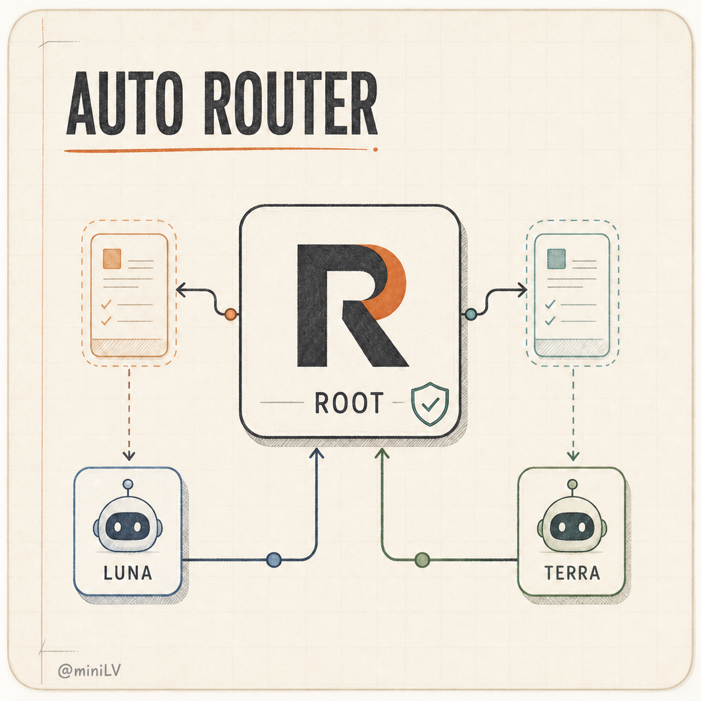

<h1 align="center">Codex Auto Router</h1>
<p align="center">
  
</p>
<p align="center">
  <strong>Astra / Medium+ runs the show. Every Main Task passes the routing gate once: judgment and acceptance stay in Root, and bounded implementation that passes the mechanical gate is delegated to one background lane by default.</strong>
</p>

<p align="center">
  A Codex-native capability-routed delivery workflow. You bring the goal and constraints; Root (<code>gpt-6-astra</code>) owns the plan, delegation, verification, and acceptance.
</p>

<p align="center">
  <a href="https://github.com/miniLV/codex-auto-router">GitHub</a> ·
  <a href="README.md">简体中文</a> · <strong>English</strong>
</p>

<p align="center">
  <a href="#quick-start"><strong>Quick start</strong></a> ·
  <a href="#routes"><strong>Routes</strong></a> ·
  <a href="#reading-the-payoff"><strong>Reading the payoff</strong></a> ·
  <a href="#updating"><strong>Updating</strong></a>
</p>

## Quick start

You need a current Codex CLI with plugins enabled, GPT-6 Astra / Medium or higher
for the primary session (confirmed from trusted current-task runtime metadata), and
the native `spawn_agent` surface. GPT-5.6 Luna / Terra access is needed only when
the selected route delegates. **No `jq` and no companion roles to install** — model,
effort, and fresh context are supplied per spawn as `spawn_agent` parameters.

```sh
codex plugin marketplace add miniLV/codex-auto-router --ref main
codex plugin add codex-auto-router@codex-auto-router
```

This marketplace follows `main` so users receive the current version. Teams that
require an immutable version should replace `main` with a published tag.

**That is the whole setup.** Every new Codex task is automatically considered once,
with no prompt required; you can also name it explicitly:

```text
Use $codex-auto-router:codex-auto-router to build this feature and verify it.
```

### Optional hardening: install the Reviewer profile (not required)

Neither core routing nor semantic review needs this. It adds value only if your
Codex build exposes a spawn parameter that selects an installed custom agent by
name; the reviewer can then receive the `read-only` sandbox the profile requests.

```sh
sh skills/codex-auto-router/scripts/install-reviewer-agent.sh
sh skills/codex-auto-router/scripts/install-reviewer-agent.sh --check
```

It installs exactly one allowlisted TOML (`codex-auto-router-astra-reviewer.toml`),
succeeds idempotently on identical content, and refuses to overwrite different
content. `--check` proves only byte-for-byte equality with the bundled template; it
does **not** prove a reviewer spawn, a fresh context, or effective isolation. Start a
new task afterwards, because custom agents are discovered at task creation.

## What you do

Give Root the outcome, constraints, and any important repository context. You do not
need to select or manage a lane; Root confirms from trusted current-task metadata
that it is `Astra / Medium` or higher, records the route decision, and owns
verification and acceptance.

## Routes

| Route decision | Use it when | Delivery |
| --- | --- | --- |
| `ROOT_DIRECT` | Default; risk is not contained, or any section of the five-part template cannot be filled concretely. | Root plans, implements, tests, self-reviews, and delivers. |
| `LUNA` | Bounded and fully mechanically checkable: a read-only evidence window, or a single-file (same-directory, same-kind) write that changes no public interface and verifies with one binary command. | `gpt-5.6-luna` · `xhigh` · `fork_turns: none`; Root verifies mechanically. |
| `TERRA` | Other implementation that passes the gate: more judgment, higher risk, multi-file. | `gpt-5.6-terra` · `high` · `fork_turns: none`; Root verifies mechanically. |

`ROOT_DIRECT` is not a route chosen for economy; it is the terminal state of every
failure path in this contract. Routing classifies by **task nature**
(implementation vs. judgment), never by perceived difficulty: a complex but purely
mechanical refactor is delegated, and a trivial question that turns on user intent
is not.

Semantic review is not a mode; it is risk-triggered. Only when the change is
persistent **and** it touches a public interface, data structure, permission, or
security path — or the child reported non-empty `JUDGMENT CALLS` / `GAPS` — is one
fresh `gpt-6-astra` / `medium` reviewer dispatched. Each candidate gets at most one
review and a Main Task at most five; it returns `ACCEPT`, `REVISE`, or
`RECONSIDER`.

## What happens automatically

Root / Astra keeps architecture, decomposition, the route decision, the dispatch
specification, mechanical verification, escalation decisions, and acceptance in the
primary task. Child work substitutes for Root work; it does not duplicate it.

- **The dispatch gate is a template to fill, not a judgment call**: every section of
  OBJECTIVE / FILES AND OWNERSHIP / INTERFACES / CONSTRAINTS / VERIFICATION must be
  filled concretely, and three checks are purely mechanical — every owned path
  resolves, every verification command has already been executed by Root with its
  result recorded, and the repository is clean with a baseline captured. Any failure
  means Root does the work.
- **At most five dispatches per Main Task**: the original plus up to four retries
  with corrected specifications; repeating an unchanged prompt is forbidden. Every
  writable path has a baseline before dispatch; on failure or unverifiable output,
  restore the baseline and continue in Root rather than dispatching again.
- **Requesting a tuple does not prove it was applied**: after dispatch, compare the
  observed model and effort against the request. A reported mismatch rejects the
  output; a host that exposes no routing metadata does not — mechanical verification
  and semantic review re-derive correctness from the artifact itself, and the
  unverified tuple is recorded as residual risk.
- **Exactly one active child at a time**, and a child may not create descendants;
  reviewer and worker never run concurrently.
- **Never silently downgrade**: Root may escalate when newly observed risk justifies
  it, but it never quietly turns TERRA into LUNA or delegation into `ROOT_DIRECT`
  without recording it.

See the [Runtime Router Policy](skills/codex-auto-router/references/routing-policy.md)
(sole canonical authority), [docs/solution.md](docs/solution.md) for the
architecture, and the [ADR index](docs/adr/README.md) for decision history.

## Reading the payoff

What routing saves: **mechanical, verifiable execution tokens move off the flagship
model (Astra) onto cheaper lanes (Terra / Luna), while Astra's tokens and effort
concentrate on judgment, verification, and acceptance.** The price gap between
models is the raw material of the payoff — the upper-left of the
[capability-vs-cost chart](https://artificialanalysis.ai/articles/gpt-5-6-has-landed/)
delivers more intelligence at a lower cost per task.

There are three observation surfaces for reading that payoff. They are all
**observers only**: by design, the Dashboard, `ccusage`, Credit estimates, model
mix, and latency are never inputs to a routing decision, so these readings are
retrospective evidence, not a control loop.

1. **Model mix migration** (the most direct). Local session token share shifts as
   you use it: when delegation actually happens, Terra / Luna token share rises and
   Astra's share falls. The **Per-task usage** table on the page shows the exact
   per-model consumption of every task.

   ```sh
   npm run setup
   npm run dashboard
   ```

   Requires Node.js 22+ and a signed-in Codex CLI. The page distinguishes
   **Subscription usage** from **Credit**, and `Model mix` comes from local session
   token share, not an official per-task bill. The **Per-task usage** table lists
   each local session (≈ one task), most recent first, with per-model token counts
   and the task total; prompts, session ids, and directories are never shown.

   

2. **Per-session token attribution**. `ccusage` is installed as an exact-pinned
   project dependency and reads session tokens by model directly:

   ```sh
   npm run ccusage -- codex session --json --since <date> --until <date>
   ```

3. **A/B comparison** (the cleanest). Run the same task twice: once with this plugin
   disabled, once enabled. Compare the two sessions' total tokens, model
   distribution, and wall-clock time — the difference is the actual effect of
   routing.

Honest boundaries: the subscription quota exposes percentages only, so there is
**no official per-task Credit**; Credit-mode attribution is a token-share
approximation (the Dashboard marks it `estimated`). The payoff readout is therefore
"share migration and trend", not an exact per-task bill. That is a deliberate
contract choice — see [ADR 0012](docs/adr/0012-gate-delegation-with-a-template-not-a-cost-estimate.md):
the dispatch gate is driven by task shape, never by a cost estimate.

## Updating

Update the marketplace plugin; there are no companion roles to reinstall. If you
installed the reviewer profile, rerun `--check` once to confirm it still matches the
bundled template byte for byte, then start a new task:

```sh
codex plugin marketplace upgrade codex-auto-router
codex plugin add codex-auto-router@codex-auto-router
sh skills/codex-auto-router/scripts/install-reviewer-agent.sh --check
```

For local development, install this checkout as a marketplace:

```sh
cd /absolute/path/to/codex-auto-router
codex plugin marketplace add /absolute/path/to/codex-auto-router
codex plugin add codex-auto-router@codex-auto-router
```

## Release

Create the version commit and tag locally, then push both:

```sh
npm run release -- 0.1.3
git push origin master v0.1.3
```

The release script aligns `package.json`, `package-lock.json`, the plugin manifest,
and the marketplace tag, then runs the full test gate. A pushed tag triggers GitHub
Actions to verify the metadata on Node 22, run tests and typechecking, and create
the GitHub Release. The public Plugins Directory still requires review and
publication through the OpenAI submission portal.

## Verification

```sh
npm test
npm run typecheck
git diff --check
```

The tests cover the routing contract, model tuples, the dispatch template, the
dispatch and review limits, the review triggers, profile exactness, Dashboard
isolation, and the local `ccusage` adapter. They validate the static contract and do
not prove that any real dispatch or review ever executed.

## Privacy and boundaries

- The Dashboard binds only to `127.0.0.1`, runs read-only, and never controls routing.
- Raw Codex session logs remain in their local locations; local model attribution
  reads existing logs and does not upload sessions.
- This repository provides a Codex skill and static contract, not a standalone
  background scheduler.
- Subscription exports use `officialCredit.kind = "subscription-quota"` and
  `localModelShare`; only Credit mode exposes `credits` in
  `estimatedCreditAttribution`. See the [Codex app-server
  documentation](https://learn.chatgpt.com/docs/app-server) for the protocol.

## License

This project is licensed under the [Apache License 2.0](LICENSE).
