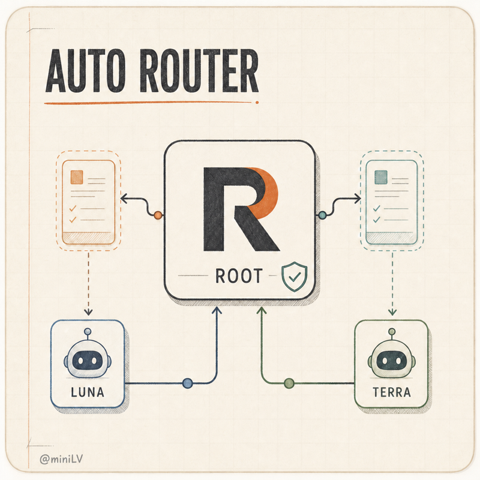
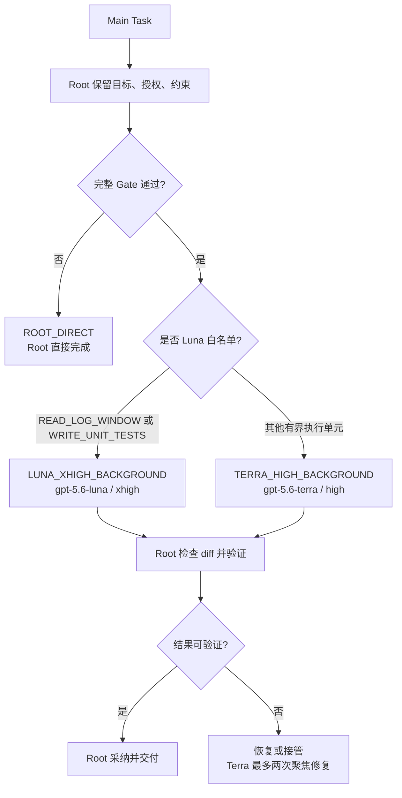

# codex-auto-router

<p align="center">
  
</p>

一个面向 Codex 主任务（Main Task）的安全自动路由约定：只有在任务足够独立、边界清晰且可以验证时，才交给一个原生子 Agent 在后台执行；否则由 Root 直接完成。

<p>
  <a href="#zh">中文（默认）</a> · <a href="#en">English</a>
</p>

GitHub README 不执行自定义 JavaScript/CSS，因此这里使用可展开的语言切换；打开页面时默认展示中文。

<a id="zh"></a>
<details open>
<summary><strong>中文（默认）</strong></summary>

## 先决条件

- Node.js 22 或更高版本
- Codex CLI（用于 `codex app-server` 的官方 Credit，以及生成供本地 `ccusage` 读取的会话日志）

请先自行安装并登录 Codex CLI，项目不会替用户安装或升级它：

```sh
# macOS / Linux
curl -fsSL https://chatgpt.com/codex/install.sh | sh

# macOS / Homebrew
brew install codex

# Windows，或任何支持 npm 的平台
npm install --global @openai/codex

codex
codex --version
npm run setup
npm start
```

`npm run setup` 会检查 Node.js、npm 和 Codex CLI，安装项目锁定的依赖并运行检查。缺少前置条件时，它只打印对应的安装命令并停止。项目使用精确锁定的本地 `ccusage` 包读取已有会话日志，不依赖全局安装、`npx` 或运行时下载。

## 核心流程：Main Task 如何自动路由

每个 Main Task 会被自动**考虑一次**，但“考虑”不等于“委派”。路由器先读取唯一的 Runtime Router Policy；完整 Gate 不通过时，任务留在 Root，不会创建子 Agent。



### 什么时候会委派

以下条件必须全部满足：

1. 工作量足够大，并且可以切成独立、有界的执行单元。
2. 仓库没有 merge/rebase、所有权或基线歧义。
3. 可以写出精确的读写路径；写入路径必须互斥。
4. 已为每个写入路径保存 preflight baseline。
5. 子 Agent 能在 fresh context 中完成，不依赖 Root 的隐含上下文。
6. 有确定的验收方式、预期结果和安全恢复方式。
7. Task Packet 完整，且预期收益大于准备、监督、复核和恢复成本。

任何一项不确定，路由结果就是 `ROOT_DIRECT`。以下任务默认留在 Root：细小或强顺序任务、产品判断、外部操作、破坏性操作、无法可靠验证的任务，以及上下文耦合过深的任务。

### 三种路由

| 决策 | 原生 tuple | 使用范围 |
| --- | --- | --- |
| `ROOT_DIRECT` | 当前 Root 模型 | 不满足 Gate，或需要 Root 判断/外部操作 |
| `LUNA_XHIGH_BACKGROUND` | `gpt-5.6-luna` · `xhigh` · `fork_turns: none` | 仅 `READ_LOG_WINDOW`、`WRITE_UNIT_TESTS` |
| `TERRA_HIGH_BACKGROUND` | `gpt-5.6-terra` · `high` · `fork_turns: none` | 其他满足 Gate 的有界执行 |

同一时间最多一个活跃子 Agent。子 Agent 不能继续委派、不能改变路由 tuple、不能扩大范围；它只负责 packet 中声明的路径和责任。

### Root 始终负责什么

Root 始终拥有用户意图、计划、授权和约束解释、高判断决策、外部动作、结果整合、最终验证与交付。子 Agent 的输出不会自动视为可信结果；Root 会对照 baseline 检查 diff，运行确定性验证，然后选择采纳或恢复。

### 失败回退

- Luna 失败：Root 先解决其路径上的 diff，随后最多为剩余的有界工作创建一次全新的 Terra 任务；不会再次创建 Luna。
- Terra 失败：同一个子 Agent 最多进行两次聚焦修复，保持相同 tuple、上下文和工作面；仍失败则由 Root 接管。

路由决定会以简短 receipt 出现在 Root 的 commentary 中，例如：

```text
Auto Router: TERRA_HIGH_BACKGROUND; reason: bounded independent implementation
```

完整规则见 [Runtime Router Policy](skills/codex-auto-router/references/routing-policy.md)、[Task Packet](skills/codex-auto-router/references/task-packet.md) 和 [Native Subagent Lifecycle](skills/codex-auto-router/references/native-subagent-lifecycle.md)。本仓库提供的是 Codex skill 与契约，不是一个独立的后台调度服务；实际路由发生在 Codex 的 Main Task 执行过程中。

</details>

<a id="en"></a>
<details>
<summary><strong>English</strong></summary>

## Prerequisites

- Node.js 22 or newer
- Codex CLI, which provides official Credit through `codex app-server` and creates the session logs read by local `ccusage`

Install and sign in to Codex CLI yourself; setup never installs or upgrades it for you:

```sh
# macOS / Linux
curl -fsSL https://chatgpt.com/codex/install.sh | sh

# macOS / Homebrew
brew install codex

# Windows, or any platform with npm
npm install --global @openai/codex

codex
codex --version
npm run setup
npm start
```

`npm run setup` checks Node.js, npm, and Codex CLI, installs locked project dependencies, and runs the checks. If a prerequisite is missing, it prints the relevant command and stops. The project uses an exact, local `ccusage` dependency in offline mode; it does not use a global install, `npx`, or runtime downloads.

## Core flow: how a Main Task is routed

Every Main Task is automatically **considered once**. Consideration does not imply delegation. The router reads the single canonical Runtime Router Policy and creates a child only when every gate passes; otherwise the task stays with Root as `ROOT_DIRECT`.

### Delegation gates

The unit must be substantial and bounded, the repository must be safe, read/write ownership must be exact, writable paths must have a captured baseline, fresh-context execution must be suitable, verification and restoration must be deterministic, the Task Packet must be complete, and the expected benefit must exceed preparation, supervision, review, and recovery cost. Uncertainty means `ROOT_DIRECT`.

### Route decisions

| Decision | Native tuple | Scope |
| --- | --- | --- |
| `ROOT_DIRECT` | Current Root model | Gate failure, judgment, external or destructive work |
| `LUNA_XHIGH_BACKGROUND` | `gpt-5.6-luna` · `xhigh` · `fork_turns: none` | Only `READ_LOG_WINDOW` and `WRITE_UNIT_TESTS` |
| `TERRA_HIGH_BACKGROUND` | `gpt-5.6-terra` · `high` · `fork_turns: none` | Other eligible bounded execution |

Only one child may be active. A child cannot delegate, change its tuple, or expand its scope. Root keeps intent, planning, high-judgment decisions, external actions, integration, final verification, and delivery. Root compares the child output with the baseline before adopting or restoring it.

### Recovery

After a Luna failure, Root resolves its paths and may create one fresh Terra task for the remaining bounded work. Terra gets at most two focused repairs with the same tuple and context; after that Root takes over.

The full contract is documented in [Runtime Router Policy](skills/codex-auto-router/references/routing-policy.md), [Task Packet](skills/codex-auto-router/references/task-packet.md), and [Native Subagent Lifecycle](skills/codex-auto-router/references/native-subagent-lifecycle.md). This repository supplies the Codex skill and contract, not a standalone background scheduler; routing happens while Codex executes the Main Task.

</details>
