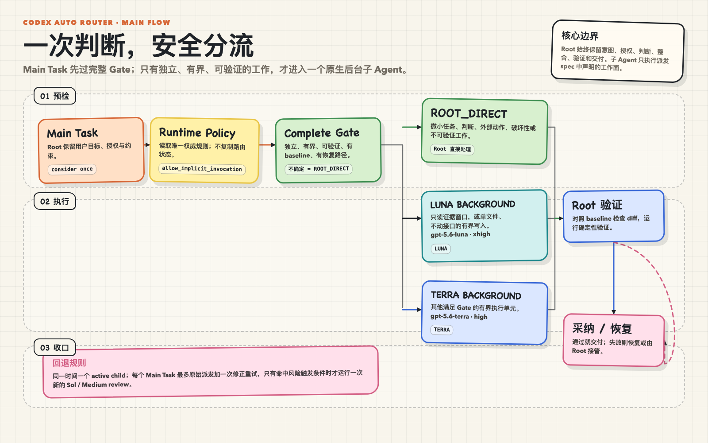

<h1 align="center">Codex Auto Router</h1>

<p align="center">
  <strong>让 Codex 的 Main Task 在质量、成本和安全边界之间自动分流。</strong>
</p>

<p align="center">
  Root 保留高判断质量；Terra / Luna 负责更轻量、更高性价比的有界后台执行。
</p>

<p align="center">
  <a href="https://github.com/miniLV/codex-auto-router">GitHub</a> ·
  <strong>简体中文</strong> · <a href="README.en.md">English</a>
</p>

<p align="center">
  <a href="#安装-skill"><strong>安装 Skill</strong></a> ·
  <a href="#核心流程"><strong>核心流程</strong></a> ·
  <a href="#可选本地-dashboard"><strong>可选 Dashboard</strong></a>
</p>

<p align="center">
  
</p>

## 它解决什么

AI 编程助手不应该把每个任务都交给最贵的模型，也不应该为了省成本牺牲 Root 的判断和最终验证。这个项目把两件事分开：

- **Sol / Root 保质量**：保留用户意图、授权解释、复杂判断、外部动作、整合、最终验证和交付。
- **Terra / Luna 降成本**：只把独立、有界、可恢复、可确定性验证的执行单元放到后台；通常更轻量、更快，也更适合重复性工程工作。
- **安全优先于价格**：成本不是单独的路由条件。只要边界、baseline、恢复路径或验收方式不清楚，就回到 `ROOT_DIRECT`。
- **本地可审计**：路由规则、Task Packet 和生命周期都在仓库内；另有可选 Dashboard，不依赖黑盒调度服务。

### 为什么现在值得路由

下图把取舍画得更直接：越靠左上，单位任务成本越低、能力越高。Sol 负责高判断工作，Luna 适合低风险执行，Terra 位于两者之间；路由的价值就是在边界清楚时选对模型。

[](https://artificialanalysis.ai/articles/gpt-5-6-has-landed/)

这正是本项目的价值：不是把任务盲目降级，而是在 Gate、精确路径、baseline、恢复与确定性验证都满足时，才把执行从 Sol 分流到 Luna 或 Terra。订阅制 Codex 的官方 Credit 与 API token 账单是两条不同口径；Dashboard 会明确显示数据源，绝不把 API 单价伪装成订阅额度的线性换算。模型定位见 [OpenAI GPT-5.6 发布说明](https://openai.com/index/gpt-5-6/)，图表与独立分析来自 [Artificial Analysis](https://artificialanalysis.ai/articles/gpt-5-6-has-landed/)。

## 安装 Skill

大多数用户只需要在 Codex 中粘贴下面这句话：

```text
请安装这个 Codex skill：
https://github.com/miniLV/codex-auto-router/tree/master/skills/codex-auto-router
```

安装完成后，从下一条 task 开始即可使用。路由能力来自 skill；不需要启动 Node 服务，也不需要打开 Dashboard。

如果希望把它作为 Codex plugin marketplace 安装，也可以使用：

```sh
codex plugin marketplace add miniLV/codex-auto-router --ref master
codex plugin add codex-auto-router@codex-auto-router
```

这两条命令只是安装 skill 包；它们不运行 `npm run setup`，也不要求安装 `ccusage`。

## 核心流程

每个 Main Task 会自动**考虑一次**，但考虑不等于委派：

1. Root 先保留用户目标、授权和约束。
2. 读取唯一的 Runtime Router Policy，并检查完整 Gate。
3. Gate 不通过，或任务需要判断、外部操作、破坏性操作、强上下文协作时，使用 `ROOT_DIRECT`。
4. Gate 通过后，只有两个明确的后台 tuple：

| 路由 | 模型 tuple | 适用范围 |
| --- | --- | --- |
| `ROOT_DIRECT` | 当前 Root / Sol | 复杂判断、外部动作、不可验证或不值得拆分的工作 |
| `LUNA_XHIGH_BACKGROUND` | `gpt-5.6-luna` · `xhigh` · `fork_turns: none` | 仅 `READ_LOG_WINDOW`、`WRITE_UNIT_TESTS` |
| `TERRA_HIGH_BACKGROUND` | `gpt-5.6-terra` · `high` · `fork_turns: none` | 其他满足 Gate 的有界执行 |

5. 同一时间最多一个 child。完成后 Root 对照 baseline 检查 diff，运行确定性验证，再决定采纳或恢复。

### 为什么 Sol 不应该承担所有执行

Sol 更适合高判断、复杂上下文和最终责任，但把它用于每个机械、可复现的后台单元会增加成本。Terra 和 Luna 的定位是用更低的执行成本覆盖清晰、可验证的工作；这不是无条件降级：

- Luna 只处理精确白名单任务。
- Terra 承担其他通过 Gate 的有界执行，最多两次聚焦修复。
- Luna 失败后，Root 先解决其 diff，再最多创建一次新的 Terra；不会再次创建 Luna。
- 任意不确定都回到 Root。

完整规则见 [Runtime Router Policy](skills/codex-auto-router/references/routing-policy.md)、[Task Packet](skills/codex-auto-router/references/task-packet.md) 和 [Native Subagent Lifecycle](skills/codex-auto-router/references/native-subagent-lifecycle.md)。

## 验证

```sh
npm test
npm run typecheck
git diff --check
```

测试覆盖路由契约、模型 tuple、Task Packet、生命周期边界、Dashboard 隔离和本地 `ccusage` 适配。

## 隐私与边界

- Dashboard 只绑定 `127.0.0.1`。
- 原始 Codex session logs 保留在本机原位置。
- 本地模型归因只读取已有日志，不上传 session。
- 本仓库提供 Codex skill 与静态契约，不是独立的后台调度服务。

## 可选：本地 Dashboard

Dashboard 不是使用 skill 的前置条件。只有想在本机查看订阅 quota、Credit 状态和 Sol/Terra/Luna token share 时才需要它：

```sh
git clone https://github.com/miniLV/codex-auto-router.git
cd codex-auto-router
npm run setup
npm run dashboard
```

前置条件是 Node.js 22+ 和已经登录的 Codex CLI；`ccusage` 会作为项目内精确锁定依赖安装，不要求全局命令。打开终端打印的 `127.0.0.1` 地址即可查看页面。

页面会明确区分 **Subscription usage** 与 **Credit**，不会和 OpenAI Platform API token 账单混算。**Model mix** 来自本地 session token share，不是官方逐任务账单。刷新失败时，底部 **Debug log** 与 **Copy debug** 可直接复制安全诊断快照。


订阅模式导出的 JSON 使用 `officialCredit.kind = "subscription-quota"` 和 `localModelShare`；只有 Credit 模式才会在 `estimatedCreditAttribution` 中提供 `credits`。Dashboard 只绑定 `127.0.0.1`、只读运行，也不会反过来控制路由。协议见 [Codex app-server 文档](https://learn.chatgpt.com/docs/app-server)。
