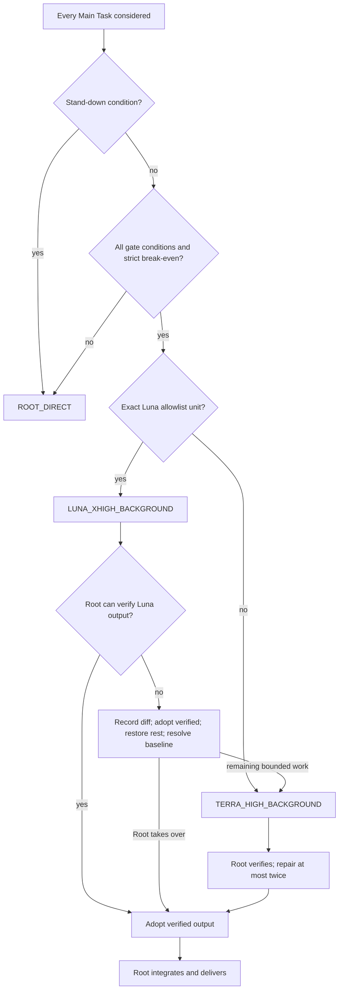

# Codex Auto Router — v2.1 Solution

Status: the repository ships a static contract for automatic routing. It has
no executable router engine. The [Runtime Router
Policy](../skills/codex-auto-router/references/routing-policy.md) is the sole
canonical deep runtime Module; metadata and the other references are shallow
Adapters, Interfaces, or the native-invocation Seam.

## Outcome

Every Main Task is automatically considered. Only a substantial, independent,
restorable unit with deterministic verification and strict positive break-even
may leave Root. Root retains intent, planning, high-judgment decisions,
external actions, integration, final verification, and delivery. The Root Model never changes.

The exact route decisions and native tuples live only in the Policy:
`ROOT_DIRECT`, `LUNA_XHIGH_BACKGROUND`, and `TERRA_HIGH_BACKGROUND`. Luna is
limited to `READ_LOG_WINDOW` and `WRITE_UNIT_TESTS`; every other eligible
bounded execution unit uses Terra. There is at most one active child and no
child delegation.

## Deep-module boundaries

- **Module:** `references/routing-policy.md` owns the hard-to-change routing
  contract: activation, stand-down, all-required gate, break-even, route
  selection, limits, and failure behavior.
- **Interface:** `references/task-packet.md` defines the complete handoff
  fields, including exact paths, baselines, verification, restoration, Luna
  allowlist data, and Terra-after-Luna evidence.
- **Seam:** `references/native-subagent-lifecycle.md` defines ownership
  transitions around native child invocation and closes every writable path.
- **Adapters:** `SKILL.md` and `agents/openai.yaml` expose the Module without
  duplicating a route table or independent state machine.
- **Depth and locality:** one active child, no Worker descendants, mutually
  exclusive paths, captured baselines, deterministic checks, and explicit
  adopt-or-restore state.

## Illustrative flow (non-authoritative)

The following diagram is illustrative only. It cannot select a route or replace
the canonical Policy linked above.

## Failure and recovery

Luna ends after success; Root inspects, verifies, and adopts only verified
output. After Luna failure or unverifiable output, Root records the complete
diff, independently verifies candidates, adopts verified candidates, restores
every non-adopted path, and records a resolved baseline. Root may then create
exactly one fresh Terra child for a remaining bounded remnant, with explicit
adoption/restoration evidence and no unverified Luna changes. No second Luna
or other fallback is allowed.

Terra keeps the same child, tuple, surface, and fresh-context boundary for its
initial attempt and at most two focused repair follow-ups. Root then resolves
all paths and takes over. No unresolved writable path may cross a lifecycle
transition.

## Runtime compatibility

If another routing or orchestration authority governs the current task, this
Skill stands down to `ROOT_DIRECT`. Sol Medium is only an external-deployment
assumption, not a local route or Root-model change.

Dashboard is an independent, read-only observer and never a routing input or control. Credits, history, labels, and local estimates remain outside the
Route Request.

## Validation and proof

`test/policy.test.ts` performs focused semantic static checks for the canonical
Module, metadata, Interface, Seam, route boundaries, Dashboard isolation, and
absence of prohibited executable artifacts. `npm run typecheck`, `npm test`,
and `git diff --check` validate the repository. These checks establish the
static contract only; runtime enforcement requires a real platform invocation
and Root's deterministic verification.
